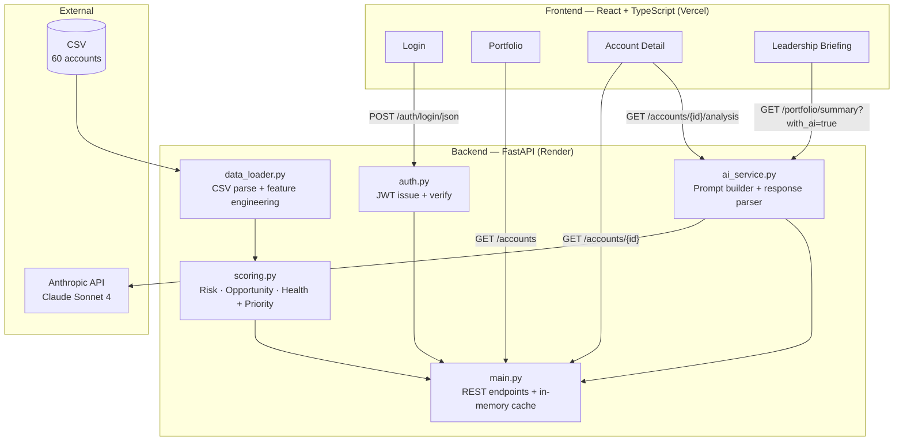
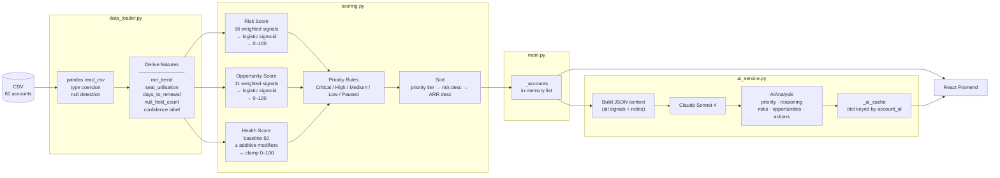
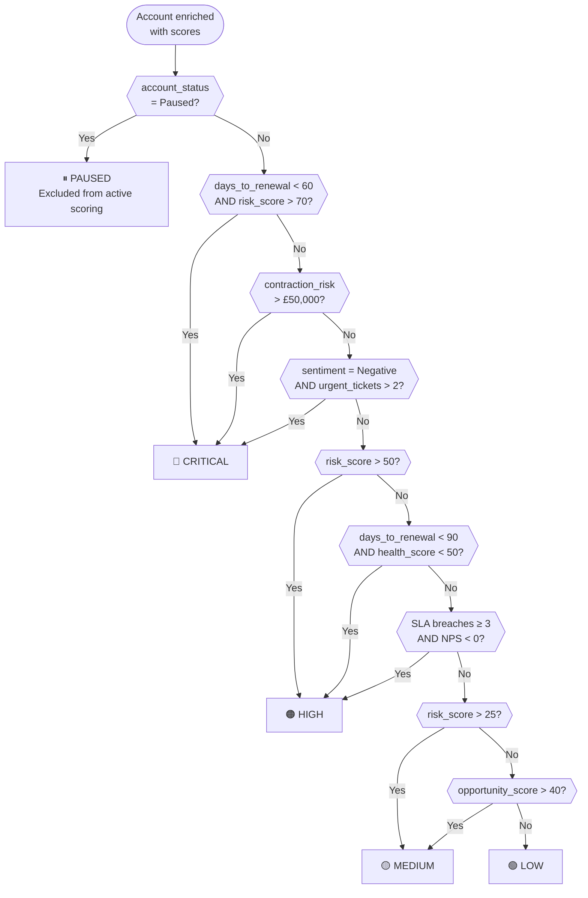
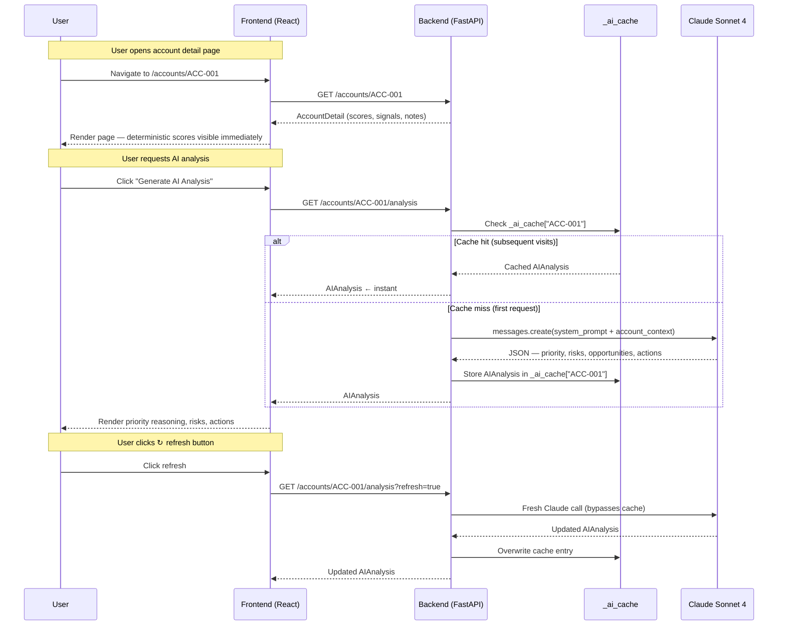
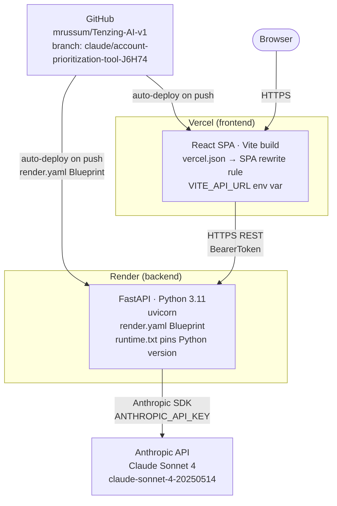

# Diagrams
## Tenzing AI — Account Prioritisation Tool

All diagrams are written in [Mermaid](https://mermaid.js.org/) and render natively on GitHub.

---

## 1. System Architecture

How the major components connect across the frontend, backend, AI layer, and deployment infrastructure.

---

## 2. Data Flow

How a raw CSV record becomes a scored, prioritised, AI-analysed account in the UI.

---

## 3. Prioritisation Decision Tree

The exact logic inside `scoring.py → assign_priority()`. Every branch cites ≥ 2 independent signals.

---

## 4. AI Analysis — Sequence Diagram

The request lifecycle for per-account AI analysis, including the server-side cache.

---

## 5. User Journey

The 7 steps from the brief's Example User Flow, mapped to the actual screens and API calls.

```mermaid
flowchart LR
    S(["Start"])

    S  --> L
    L  --> P
    P  --> T
    T  --> D
    D  --> R
    R  --> A
    A  --> REC
    REC --> E(["Done"])

    L["① Sign In\nLogin.tsx\nPOST /auth/login/json\n→ JWT stored"]
    P["② Portfolio Overview\nPortfolio.tsx\nKPI row + priority\ndistribution chart"]
    T["③ Prioritised Accounts\nSorted table\nCritical → High → Medium → Low\nFilters + search"]
    D["④ Drill Into Account\nAccountDetail.tsx\nCommercial · Health\nSupport · Leads · Notes"]
    R["⑤ Reasoning & Evidence\nAIPanel.tsx\npriority_reasoning\ntop_risks with evidence"]
    A["⑥ Recommended Actions\nAIPanel.tsx\n3 actions with owner\nCSM / Sales / Leadership"]
    REC["⑦ Record Decision\nDecisionRecorder.tsx\nPOST /accounts/{id}/decisions\nTimestamped + attributed"]
```

---

## 6. Deployment Topology

How the two deployed services connect to each other, the source repo, and the Anthropic API.

